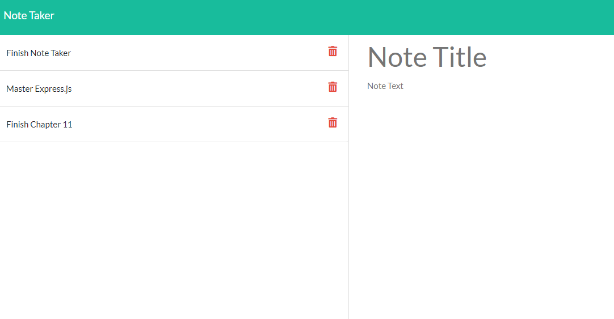

  # Note Taker 

  ## Description
  An express.js application designed to allow users to write and save notes to organize thoughts and keep track of tasks.
  
  ## Installation
  Packages required to run this program are: npm, express.js, uuid, uuidv4

  ## Contributors
  Joseph DeFelice

  ## Preview
  View the project in GitHub at: https://infinite-retreat-23536.herokuapp.com/
  